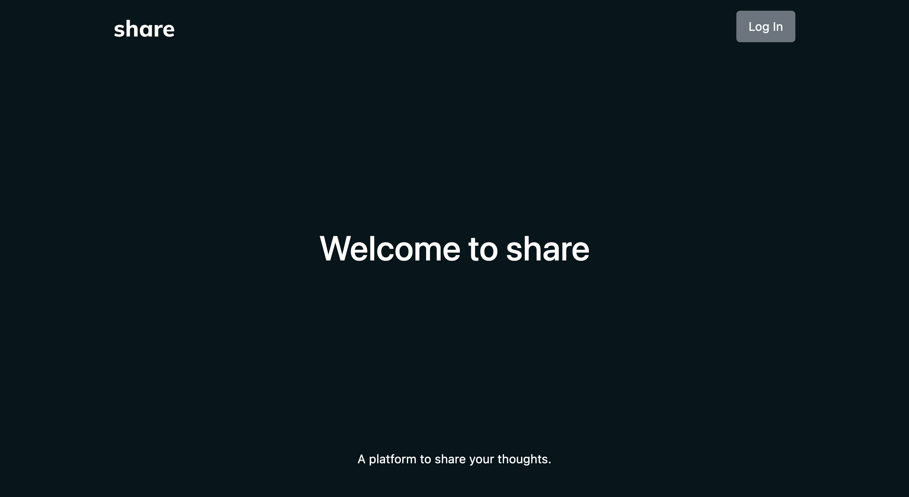
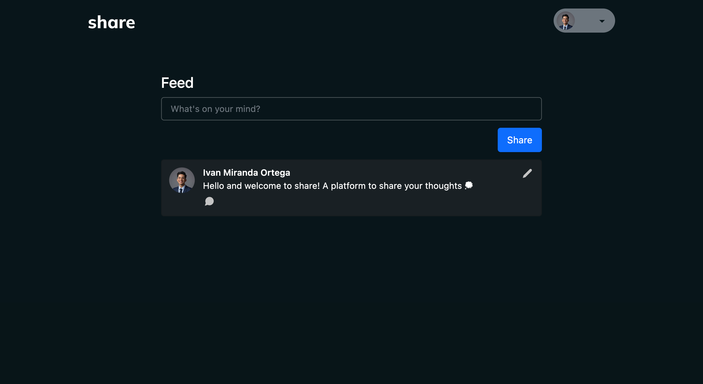
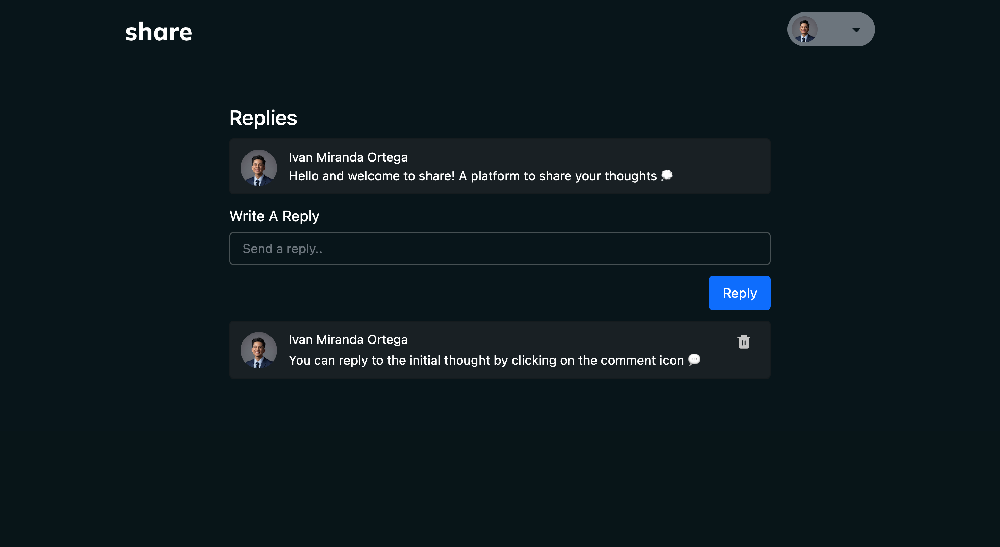

# share

A platform to share your thoughts. 

This web app allows a user to log in through Google OAuth and post/edit what ever is on their mind. Authorised users can reply and delete their replies to each other user's thoughts.

## Screenshots: 

## Technologies Used:
- CSS 
- Bootstrap 5
- JavaScript 
- Google OAuth 2.0
- Express 
- Node.js
- MongoDB
- Heroku

## Getting Started: 
[share](https://share-seir-app.herokuapp.com/)

[Trello](https://trello.com/b/IWzYwzPM/mythoughts-web-app)

[High Fidelity Wireframe](https://www.figma.com/file/R6cWwOsXt86pRlL42ubIwb/share-web-app?node-id=0%3A1)

## Next Steps:
- As a user, I want to like other user's thoughts 
- As a user, I want to upload media files 
- As a user, I want to search for other users